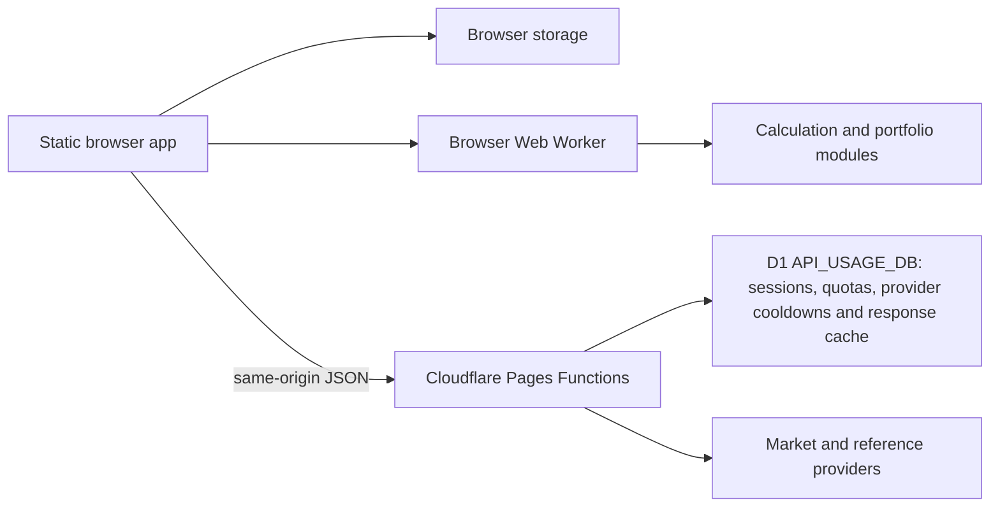

# Architecture and portability

## Product boundary

Synthora is a browser-first financial planning and portfolio-tracking tool. The browser owns personal profile, saved recommendation history, model settings, and portfolio-ledger data. The server provides market and reference data, and protects provider usage. Planning and simulation outputs are transparent scenarios, not price forecasts or instructions to trade.

The current deployable shape is a static site plus same-origin /api/ routes. Cloudflare Pages is the first hosting target. This document describes where Cloudflare-specific behavior currently lives and how to keep a later move to another edge platform or a small server practical.

## Current system

| Layer                                                                | Current responsibility                                                                                |
| -------------------------------------------------------------------- | ----------------------------------------------------------------------------------------------------- |
| index.html, app.js, styles.css                                       | Static Persian-first interface, browser workflows, local persistence, and API calls                   |
| src/engine.js                                                        | Dependency-free planning, simulation, return-model, and backtest calculations                         |
| src/analysis.js, src/analysis.worker.js                              | Analysis task selection and background execution in the browser                                       |
| src/portfolio.js, src/history.js                                     | Versioned ledger, valuation, validation, and portable JSON export/import                              |
| src/market/                                                          | Shared instrument catalog, observed-history processing, cache age, and quote reconciliation           |
| src/ui/                                                              | UI state, navigation, components, localization, locale/display preferences, and chart helpers         |
| functions/api/market.js, history.js, inflation.js, fx.js, session.js | Server-side provider access and same-origin JSON routes                                               |
| functions/api/_security.js                                           | Signed browser-session handling, route quotas, provider request limits, and cached provider responses |
| functions/api/migrations/                                            | D1 schema migrations; apply in numeric order                                                          |
| tests/                                                               | Node tests for calculations, data contracts, API routes, portfolio records, and UI helpers            |

The browser keeps personal data in local storage. The D1 binding named `API_USAGE_DB` stores hashed API-session identifiers, request counters, provider cooldown state, and selected shared provider-response cache entries. That response cache is not a canonical normalized price-history store and is not the portfolio database. CoinGecko user keys are sent in a request header and may be held in page, session, or device storage according to the user's setting; server provider keys belong in Cloudflare secrets.

The API routes are file-based Pages Function handlers. They use standard Request, Response, fetch, and Web Crypto APIs in many places, but they also consume the Cloudflare context.env binding, D1's prepared-statement interface, and Cloudflare-specific cf fetch options. The current server layer is therefore Cloudflare-compatible, but not yet runtime-neutral.

## Portability boundary

Keep these three responsibilities distinct:

1. **Domain logic:** calculations, portfolio rules, history validation, and normalized market records. Keep this code independent of Cloudflare, Node server APIs, provider payloads, and the DOM.
2. **HTTP contract:** same-origin JSON endpoints, status codes, cookies, headers, and response shapes. Keep route behavior stable when replacing the hosting runtime.
3. **Runtime adapters:** route registration, secret/config access, D1 reads and writes, provider fetch caching, and platform-specific request options. Keep provider and hosting details here.

The most important current migration seam is persistence. functions/api/_security.js currently runs D1 SQL directly. Replacing Cloudflare requires an adapter for session lookup, atomic route quotas, monthly provider budgets, cooldowns, and the provider-response cache. A process-local Map is suitable only for coalescing overlapping requests in one process; it cannot replace shared quota state or durable storage.

For another edge provider, map its request lifecycle and durable SQL or key-value services behind the same route and storage contracts. For a lightweight single-server deployment, serve the static files and /api/ from one small HTTP service. A local database can suit a single process; multiple application instances require shared durable storage. In either case, keep the UI and financial-domain modules unchanged where possible, and preserve the security and data-quality behavior as part of the adapter.

Do not add a second runtime or abstract every platform call in advance. When a real migration target is selected:

- Identify the exact Cloudflare-specific calls and bindings used by each route.
- Define the storage operations needed by the existing behavior before selecting a replacement database.
- Implement the alternate route and storage adapters while keeping the Cloudflare adapter available.
- Reuse provider normalization and response-contract coverage; add adapter-specific coverage for atomic quotas, session validation, and persistence.
- Compare deployed API responses and failure behavior before changing the default host.

## Deployment and local development

The local Pages Functions preview command is:

    npx wrangler pages dev . --compatibility-date=2026-09-18

The Cloudflare setup guide describes the D1 binding, SQL migrations, secrets, and route checks: [Cloudflare market API setup](cloudflare-market-api.md). Before deploying a code change, check every current migration and environment-variable use in functions/api/; the setup guide must match those files.

There is no CI/CD workflow in the repository. Keep development and deployment instructions manual unless the product owner asks for automation.

## Documentation authority

See the [documentation index](README.md) for the current owner and status of each project document.

- README.md describes product behavior, model concepts, local commands, and the initial Cloudflare deployment.
- docs/market-data-and-forecasting.md and docs/financial-model-audit.md hold market-data and calculation invariants.
- docs/cloudflare-market-api.md describes the current Pages Functions setup.
- docs/data-persistence-and-sync-plan.md is a research-backed proposal. It does not mean accounts, sync, remote user records, or scheduled market ingestion exist or are approved for implementation.
- Audit and QA documents are historical records of particular reviews, not current release status. Verify behavior in source and tests when they disagree with the implementation.
