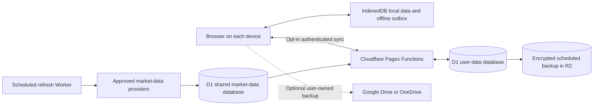

# Synthora Data Persistence, Sync, and Backup Plan

**Status:** Research-backed implementation proposal  
**Prepared:** 2026-09-26  
**Scope:** User data durability, cross-device sync, shared public market data, backups, privacy, cost controls, and phased implementation. This is a plan; no application code has been changed.

## 1. Executive recommendation

Build Synthora as a local-first product with optional cloud sync:

1. Keep an offline local copy of personal data in IndexedDB.
2. Offer opt-in account sync backed by a dedicated Cloudflare D1 database. Keep users able to use Synthora without creating an account.
3. Persist public market and inflation observations once for the platform and reuse them across users. Do not store copies of shared market data in each user's account.
4. Keep a full, versioned JSON export/import. Add scheduled Cloudflare-side backups for the sync database.
5. Add Google Drive or OneDrive as a user-owned backup destination only after cloud sync is stable and users ask for it. Start with one provider, not several.

This is the lowest-friction option that fits the existing Cloudflare deployment and current small user base. It does not mean the service is unlimited or that Cloudflare cannot access server-side user records. The product must state clearly which data is uploaded and who operates the storage.

### Recommended storage choices shown to users

| Choice                    | What it means                                                                                          | Initial availability                 |
| ------------------------- | ------------------------------------------------------------------------------------------------------ | ------------------------------------ |
| This device only          | Personal data stays in this browser profile. It works offline; users export a backup themselves.       | Default; no account required         |
| Sync with Synthora        | Local copy syncs to Synthora's authenticated Cloudflare service and can be restored on another device. | First cloud feature                  |
| Back up to my cloud drive | A user-visible backup file is written to the user's Google Drive or OneDrive account.                  | Later, optional provider integration |

Do not make cloud sync opt-out by default. Ask before the first upload, state which fields sync, and provide pause, export, delete, and sign-out controls.

## 2. Current state and problem definition

Repository review and current documentation show:

- Profile, salary, recommendation history, portfolio ledger, and model settings are stored in browser `localStorage` from [`app.js`](../app.js); locale/display preferences and navigation/cache preferences are handled by [`src/ui/preferences.js`](../src/ui/preferences.js) and [`src/ui/state.js`](../src/ui/state.js). These survive a normal reload but do not follow the user to another browser profile or device.
- The browser reuses its market response cache for up to 90 seconds and historical comparison responses for up to one hour, retaining only a small number of recent query combinations. These client caches are not durable market history. The user can disable browser market-cache fallback.
- `/api/market`, `/api/history`, `/api/inflation`, and `/api/fx` run through Cloudflare Pages Functions. Migration 0002 adds a D1 cache of selected public provider responses and shared provider cooldown state. This is operational request coordination, not a canonical normalized history store. `/api/history` still fetches and normalizes source history per request; there is no shared, durable validated price-history dataset. The inflation route uses Cloudflare's upstream fetch cache, not a versioned CPI archive.
- Migrations [`0001_api_quotas.sql`](../functions/api/migrations/0001_api_quotas.sql) and [`0002_provider_coordination.sql`](../functions/api/migrations/0002_provider_coordination.sql) create API-session, route-usage, monthly provider-budget, cooldown, and provider-response cache state. The signed cookie in [`functions/api/_security.js`](../functions/api/_security.js) identifies a browser session for quotas; it is not a Synthora account.
- The current versioned JSON transfer covers saved recommendation history and the personal portfolio ledger. It does not include profile/salary, model settings, interface preferences, transient caches, or API keys, so it is not a full personal-data backup.
- The recommendation and portfolio model already distinguishes observed source history from assumptions and missing data. Persistence work must preserve those distinctions and must never fabricate missing market observations.

Clearing browser data needs precise product wording. A browser's “clear cookies” action can be separate from “clear site data”; the latter can remove local storage and other origin data. IndexedDB and the Storage API can improve local storage behavior but cannot guarantee recovery after a user explicitly deletes site data. See [MDN's storage and eviction guidance](https://developer.mozilla.org/en-US/docs/Web/API/Storage_API/Storage_quotas_and_eviction_criteria).

## 3. Product goals and boundaries

### Goals

- Users can keep using the app without an account.
- Users can opt into cross-device sync and recover their profile, saved recommendations, and portfolio ledger after a device or browser change.
- Offline edits survive reloads and sync later without duplicate or silently lost records.
- Public market history is fetched and validated centrally at a controlled cadence, then reused by all users.
- Every synced user can export a complete, portable backup and request deletion of server-side records.
- The architecture stays inside Cloudflare's free tiers at current small scale, degrades safely when a quota or provider is unavailable, and measures usage before it approaches a limit.
- Financial outputs retain provenance, timestamps, gaps, schema versions, and auditability.

### Out of scope for the first release

- Mandatory accounts or social features.
- Realtime collaboration between simultaneous editors.
- Multiple cloud-drive providers at launch.
- Using a stale quote as if it were current, or interpolating missing historical prices.
- A promise of end-to-end encryption until key recovery and restore have been designed and verified.
- A guarantee that every third-party API or free tier will remain free forever.

## 4. Target architecture



### Database separation

Use separate logical ownership and preferably separate bindings:

- `API_USAGE_DB`: current signed API sessions, route counters, monthly provider-key budgets, cooldowns, and selected public provider-response cache entries.
- `USER_DATA_DB`: accounts, preferences, recommendation snapshots, portfolio transactions, sync revisions, and deletion state.
- `MARKET_DATA_DB`: shared observed quotes, historical observations, inflation observations, provider status, and refresh metadata.

This keeps user financial data out of the API-quota tables and makes authorization reviews easier. D1's daily account quotas are shared across the account, so database separation is for access boundaries and lifecycle clarity; it does not multiply the free quota.

R2 is optional for the first sync release. Add it for durable database snapshots after measuring export size. Keep full user exports portable and available independently of Cloudflare.

## 5. Data classification and persistence rules

| Data                       | Examples                                                                               | Local storage                                                                               | Cloud storage                                                | Rules                                                                         |
| -------------------------- | -------------------------------------------------------------------------------------- | ------------------------------------------------------------------------------------------- | ------------------------------------------------------------ | ----------------------------------------------------------------------------- |
| Personal profile           | Age, horizon, salary, contribution rate, goals, risk inputs                            | IndexedDB                                                                                   | `USER_DATA_DB` only after sync opt-in                        | Treat as sensitive; validate and minimize fields                              |
| Saved user records         | Recommendation snapshots, portfolio versions, transactions, corrections, manual prices | IndexedDB                                                                                   | `USER_DATA_DB` for signed-in users                           | Stable record IDs; preserve audit references and deletion tombstones          |
| App preferences            | UI preferences, model settings                                                         | IndexedDB                                                                                   | Sync only settings needed across devices                     | Version the schema; exclude device-specific settings where appropriate        |
| Provider credentials       | CoinGecko user key, OAuth tokens, session cookies                                      | Existing per-device/session storage or secure server-side credential store if ever required | Never include in ordinary sync payloads or user JSON exports | Secrets must not be logged or exposed in URLs                                 |
| Shared public observations | Quotes, observed price history, annual CPI                                             | Read-through local cache                                                                    | `MARKET_DATA_DB` once for all users                          | Preserve source, observed time, fetch time, unit, quality, and policy version |
| Derived calculations       | Current plan preview, charts, simulation outputs not explicitly saved                  | Recompute locally                                                                           | Do not sync by default                                       | Save only when the user explicitly creates a history snapshot                 |

The full export should include all personal data needed to reconstruct the user's workspace, including profile and settings if the user chooses them. It should include `schemaVersion`, `exportedAt`, record IDs, currency/unit declarations, portfolio versions, and data provenance. Exclude provider API keys, login tokens, cookies, transient caches, and any server secrets.

## 6. Sync and conflict semantics

Use local-first writes with an authenticated synchronization protocol:

1. Validate and save each edit locally first. The UI may say “saved on this device” immediately.
2. Add a durable, idempotent operation to an IndexedDB outbox. Do not depend on an in-memory timer for unsynced edits.
3. When online and signed in, send a bounded batch with a client-generated idempotency key and the server revision on which the edit was based.
4. The server derives `user_id` from the validated session, validates the payload, and applies the write transactionally. Never accept a client-supplied user ID as authority.
5. Return the new server revision. The client removes only acknowledged operations from the outbox and shows “synced” only after that acknowledgment.
6. If the revision changed, return a conflict response and merge by record identity. Present a recoverable conflict when values cannot be safely merged; never silently replace the cloud copy with an older device snapshot.
7. Retry transient network and quota errors with bounded exponential backoff. Keep local edits intact while retrying.

### Record-specific behavior

- **Profile and preferences:** merge independent fields; when the same field changed on both devices, show the two values and let the user choose. Do not use untrusted device clocks as the only conflict rule.
- **Recommendation history:** immutable snapshots with stable IDs. Merge records by ID; a timestamp alone is not a unique key.
- **Portfolio ledger:** append transactions by stable ID. Corrections and removals are new audited events or tombstones. Never replace the entire ledger without a restore preview and explicit user action.
- **Tracking restarts:** retain earlier portfolio versions so historical valuations can still be explained and reproduced.
- **Deletion:** propagate tombstones so an old offline device cannot silently re-create a record the user removed. Define a retention window for backup copies separately from live account deletion.

For the first release, a small number of versioned per-user domain records is easier to reason about than a single unversioned JSON blob. Keep payloads small and limit the number of records per request. The implementation may group low-change profile fields, but ledger/history records should remain independently addressable.

## 7. Shared market-data persistence

Public observations should be common to all users. A scheduled Worker should fetch each approved provider at a deliberate cadence rather than having every user load invoke all upstream sources.

### Observation record

Store, at minimum:

- stable asset ID and unit;
- source/provider ID and source URL where permitted;
- raw currency and normalized value;
- upstream `observedAt` when provided, and separate `retrievedAt`;
- quality/confidence, source count, outlier or conflict status, and policy version;
- a stable uniqueness key such as `(asset_id, provider_id, observed_at)`;
- parser/schema version and refresh result.

Writes must be idempotent. Persist only successfully parsed and validated observations. Keep missing coverage missing. Continue to distinguish current live quotes from older history and derived currency conversions. Retain the existing rule that last-known market data may be displayed with a clear age label but is not silently used as a current valuation.

Before storing and re-serving provider data centrally, review each provider's current terms, caching/redistribution rights, attribution requirements, and rate limits. The repository's market-data documentation already calls for this review. If a source does not permit the planned use, do not persist or redistribute it; choose an acceptable source or leave that coverage unavailable.

Use a public response cache only for responses that contain no user-specific fields. `Cache-Control` and conditional requests can reduce repeated transfer, but Cloudflare's Workers Cache API is data-center-local and is not durable storage. Keep D1 as the canonical shared observation store.

## 8. Identity, security, and privacy

### Identity decision gate

Choose one sign-in method before implementing cloud sync. Google Sign-In may be a low-cost first option if it suits Synthora's users, but sign-in does not automatically grant Google Drive access. Drive backup requires a separate, narrow scope and user consent. If the audience needs another sign-in method, decide that before creating account records so identity migration is not an afterthought.

Google documents `drive.appdata` as a non-sensitive scope for hidden app data and `drive.file` for app-created or user-selected files. The hidden app-data folder is not visible in Drive and is deleted when a user uninstalls the app. A visible user-selected backup file is more portable and easier for a user to inspect. [Google Drive app-data](https://developers.google.com/workspace/drive/api/guides/appdata) and [scope guidance](https://developers.google.com/workspace/drive/api/guides/api-specific-auth) describe the tradeoffs. Microsoft Graph's App Folder offers a narrow `Files.ReadWrite.AppFolder` permission, but users can delete or replace its files and requests must handle throttling. [Microsoft App Folder](https://learn.microsoft.com/en-us/graph/onedrive-sharepoint-appfolder) and [throttling guidance](https://learn.microsoft.com/en-us/graph/throttling).

### Security requirements

- Validate identity tokens server-side: issuer, audience, expiration, signature, and stable provider subject.
- Issue opaque, random, HttpOnly, Secure-on-HTTPS, SameSite cookies. Keep auth/session records server-side and scope them to the account.
- Protect state-changing requests against CSRF and enforce same-origin rules. Use parameterized D1 queries.
- Authorize every read, update, export, and deletion against the authenticated user ID. Add cross-user access tests.
- Bound request body size, item counts, and per-account sync frequency. Keep the current API-session quotas separate from authenticated account quotas.
- Do not log profiles, transaction notes, access tokens, API keys, exported JSON, or full request bodies.
- Set retention periods and provide account export, sync pause, sign-out, and cloud-data deletion controls.
- Review production database location and applicable privacy commitments before collecting user records. Cloudflare selects D1's automatic location at database creation; jurisdiction constraints must also be chosen at creation. See [D1 data location](https://developers.cloudflare.com/d1/configuration/data-location/).

D1 encrypts data at rest and uses TLS in transit, with encryption keys managed by Cloudflare. This supports protected server-side storage but does not make the service end-to-end encrypted against its own operators. [D1 data security](https://developers.cloudflare.com/d1/reference/data-security/). If Synthora later promises end-to-end encryption, encrypt on the client and complete a restore/key-loss design first. WhatsApp's encrypted-backup model is a useful reference for explicit backup opt-in and recovery-key responsibility; a lost secret can make a backup unrecoverable. [WhatsApp encrypted backup](https://faq.whatsapp.com/490592613091019/).

## 9. Backup, restore, and deletion

### User recovery

- Provide **Export all my data** and **Restore from file** from Settings.
- Preview import contents and conflicts before applying them. Offer merge or restore choices; do not silently replace newer cloud state.
- Preserve the existing specialized history and portfolio import paths until a full-export format has passed migration and restore checks.
- Show last local save, last cloud sync, and last successful backup separately.
- Make “clear this device,” “pause sync,” “delete cloud data,” and “delete account” separate, plainly named actions.

### Platform recovery

- Treat D1 Time Travel as short-term recovery, not the only backup. Current Free-plan Time Travel retention is seven days.
- After measuring real database size, create a scheduled encrypted R2 export for the user-data database. Proposed initial retention: seven daily, four weekly, and six monthly restore points, subject to the R2 storage budget and tested export size.
- Keep user-facing JSON exports independent of server backups. If users request a different provider boundary, add visible Google Drive or OneDrive backups later.
- Test restoration into a staging database before launch and at least quarterly after launch. Record the restore steps and expected RPO/RTO.
- Proposed initial operational targets for approval: **RPO ≤ 24 hours** for a platform incident using the daily backup, and **restore service within one business day**. D1 Time Travel can cover recent operator mistakes inside its seven-day window.
- Account deletion must remove live rows and define when retained backups expire. Do not claim immediate physical erasure from historical backups unless the retention mechanism actually provides it.

## 10. Free-tier and cost guardrails

Current published limits checked on 2026-09-26:

| Service                            | Current free allowance relevant to Synthora                                                                                                                                                       | Design implication                                                                                                                         |
| ---------------------------------- | ------------------------------------------------------------------------------------------------------------------------------------------------------------------------------------------------- | ------------------------------------------------------------------------------------------------------------------------------------------ |
| Cloudflare Pages/Workers           | 100,000 dynamic Worker/Pages Function requests per day; 10 ms CPU per request on Workers Free. Static asset requests are free and unlimited.                                                      | Keep API work small, batch sync calls, measure CPU, and allow local-only use when functions are unavailable.                               |
| Cloudflare D1                      | 5 million rows read/day, 100,000 rows written/day, 5 GB total account storage, 500 MB max per Free database, seven-day Time Travel. Exceeding daily limits causes D1 queries to fail until reset. | Use indexed user/asset keys, debounce writes, cap history retention intentionally, and surface degraded sync without losing local changes. |
| Cloudflare R2 Standard             | 10 GB-month storage, 1 million Class A and 10 million Class B operations/month; no egress charge.                                                                                                 | Suitable for small scheduled exports if measured snapshots and retention stay within the cap.                                              |
| Firebase Firestore                 | 1 GiB stored data; 50,000 reads/day; 20,000 writes/day and deletes/day; 10 GiB/month transfer. Backups and point-in-time recovery require billing.                                                | Credible alternate managed database, but it adds a second provider and backup features are not free.                                       |
| Supabase Free                      | 500 MB database and 5 GB egress in current billing docs. Low-activity Free projects may be paused after seven days.                                                                               | Strong Postgres/auth option, but idleness is a real fit risk for a small, intermittent audience.                                           |
| Google Drive / OneDrive app folder | File data consumes the user's own provider storage quota; APIs have OAuth, consent, rate limits, and user deletion/revocation behavior.                                                           | Reduces Synthora-hosted file storage, but transfers provider setup, account dependency, and some support burden to users.                  |

Sources: [Pages Functions pricing](https://developers.cloudflare.com/pages/functions/pricing/), [Workers limits](https://developers.cloudflare.com/workers/platform/limits/), [D1 pricing](https://developers.cloudflare.com/d1/platform/pricing/), [D1 limits](https://developers.cloudflare.com/d1/platform/limits/), [R2 pricing](https://developers.cloudflare.com/r2/pricing/), [Firestore quotas](https://firebase.google.com/docs/firestore/quotas), [Supabase billing](https://supabase.com/docs/guides/platform/billing-on-supabase), and [Supabase inactivity pause policy](https://supabase.com/docs/guides/platform/free-project-pausing).

Free tiers can change. Design so the financial model does not depend on a free allowance being unlimited: store small records, use shared market ingestion, expose export formats, monitor usage, and keep a tested migration path. Cloudflare D1's daily quotas fail closed for D1 queries after exhaustion; local edits must stay available and queued until service resumes.

### Operational metrics and alerts

Track aggregate, non-sensitive metrics:

- Pages Function requests/day and CPU-limit errors;
- D1 rows read/written/day, storage size, and query errors;
- sync success rate, retry queue age, conflict rate, and time from local save to cloud acknowledgment;
- market provider calls per refresh cycle, provider failures, latest observation age, and missing coverage;
- backup age, compressed size, last restore drill, and R2 storage/operation use;
- export/import validation failures and account deletion completion.

Set warnings at 50%, 75%, and 90% of each applicable free allowance. These are internal operating thresholds, not user request quotas. Keep detailed financial values out of telemetry.

## 11. Phased implementation plan

Each phase should end with a reviewed diff, focused automated coverage, a migration/rollback note, and a staging deployment where applicable. Do not combine all phases into one large change.

### Phase 0 — Product decisions and data inventory

**Work:** Confirm the default local-only behavior, initial sign-in method, fields included in sync/export, cloud-data retention, database location, provider terms, and whether server-side encryption meets the intended privacy promise. Inventory all existing local-storage keys, migrations, import/export paths, market caches, and saved record schemas.

**Deliverables:** Decision record; data-flow diagram; current-to-target field map; provider permission/terms checklist; migration and rollback plan; initial RPO/RTO agreement.

**Exit criteria:** No unresolved choice about account identity, data upload consent, market-source redistribution, or cloud-data deletion remains before affected code is written.

### Phase 1 — Local durability and complete portable backup

**Work:** Introduce a versioned IndexedDB repository for personal records and an idempotent migration from current `localStorage`. Add full-data JSON export/import with schema validation, preview, and conflict choices. Keep migration recoverable: do not delete old values until the new copy is verified and the user data can be read back.

**Exit criteria:** Existing local users retain data across upgrade; reload and offline edits work; corrupt or unsupported imports are rejected without altering current data; the export contains all promised personal records and no credentials; users can restore the file in a fresh browser profile.

### Phase 2 — Shared public data ingestion

**Work:** After provider rights are reviewed, create the shared market-data schema and an appropriately scheduled refresh job. Make the public API read from validated stored observations. Keep quote freshness and historical coverage explicit. Add retention/indexing and conditional response caching where safe.

**Exit criteria:** Multiple browser requests within a refresh interval do not each trigger the same upstream history pull; source attribution and observation timestamps survive; provider failures are visible; no missing period is fabricated; the existing valuation rules still reject conflicted or unavailable points.

### Phase 3 — Account identity and private D1 storage

**Work:** Select and implement one identity provider. Create the `USER_DATA_DB` schema and authenticated server-side session. Keep `API_USAGE_DB` for API/session quotas. Add per-user authorization and request validation before any personal records are accepted.

**Exit criteria:** A user can sign in/out and export/delete their cloud records; one account cannot read or alter another account's rows; unauthenticated endpoints cannot reach personal data; sessions and state-changing requests have CSRF protection; logs contain no personal payloads.

### Phase 4 — Offline-first cross-device sync

**Work:** Add a durable IndexedDB outbox, batched idempotent sync API, server revisions, and conflict handling by stable record ID. Sync profile/preferences and immutable recommendation/ledger records with domain-specific merge rules. Add retry/backoff and a manual “sync now” control.

**Exit criteria:** Two devices converge after online sync; local edits survive network loss/reload; retries do not duplicate transactions; stale clients receive a conflict rather than overwriting newer data; deleted records remain deleted when an old device reconnects; local-only users continue to work.

### Phase 5 — Server backup, recovery, retention, and deletion

**Work:** Add a scheduled, encrypted R2 backup for the user-data database if measured size fits the budget. Implement retention and restore procedure. Add verified account deletion and distinguish it from sign-out, sync pause, and clearing one device.

**Exit criteria:** Restore drill succeeds in staging from both D1 Time Travel and a retained R2 snapshot; backup age and size are monitored; deletion behavior and backup retention are documented; data export and restore are usable by a non-developer.

### Phase 6 — User experience, privacy notice, and gradual release

**Work:** Add a Settings storage section, first-sync choice, conflict/restore previews, sync status, offline/pending states, privacy copy, and account controls. Keep copy Persian and RTL. Release behind a feature flag or limited cohort, then widen after observing sync and restore metrics.

**Exit criteria:** Users can explain where each data category is stored; no upload occurs before opt-in; sync failures do not hide local data; support can guide export/restore from the UI; cohort metrics show acceptable failure/conflict rates.

### Phase 7 — Optional personal-drive backup provider

**Work:** If user feedback supports it, implement one connector first. Prefer a visible user-controlled backup file with least-privilege permissions when portability and manual inspection matter. Keep the provider adapter separate from the core sync protocol. Add Microsoft Graph/OneDrive only after validating the Google flow or if audience demand points to OneDrive first.

**Exit criteria:** Consent requests only the needed scope; token lifecycle and revocation are handled; 429 responses honor provider retry guidance; backup file is versioned and recoverable after a browser reset; removing provider access leaves the local and Synthora export paths intact.

## 12. Verification and launch acceptance

Before enabling cloud sync for all users, verify these scenarios in automated and browser-level coverage:

1. Existing local data migrates once and remains readable after reload and browser restart.
2. A fresh browser can restore a full JSON export and match the original profile, saved history, and ledger.
3. Clearing one device's site data does not affect server data; signing in again restores the cloud copy after an explicit restore/merge choice.
4. Offline edits persist after reload, queue, retry, and apply exactly once after reconnection.
5. Two devices editing separate records merge; two devices editing the same profile field produce a visible conflict.
6. Stale sync payloads cannot delete or overwrite newer portfolio records.
7. Cross-user access attempts fail for reads, writes, exports, and delete actions.
8. Provider outage, D1 quota exhaustion, and expired identity token keep local data intact and show a recoverable state.
9. Shared market requests reuse stored observations; provenance, freshness labels, gaps, and quality status survive serialization.
10. Backup restore, account deletion, sync pause, sign-out, and local clear each do the distinct action stated in the UI.
11. Persian RTL screens work at mobile and desktop sizes; sync status and conflicts are keyboard accessible.
12. API keys, access tokens, session cookies, profiles, and transaction notes never appear in URLs, logs, or ordinary export payloads.

## 13. Risk register

| Risk                                                         | Mitigation                                                                                                                           |
| ------------------------------------------------------------ | ------------------------------------------------------------------------------------------------------------------------------------ |
| User clears site data before enabling sync/export            | Promote export, explain device-only storage, and make opt-in sync easy to find.                                                      |
| A sync conflict silently loses a transaction or correction   | Stable IDs, append-only ledger events, server revisions, tombstones, and explicit conflict recovery.                                 |
| Shared caching violates a provider's terms                   | Review redistribution, retention, attribution, and rate limits before central persistence; use an approved source where necessary.   |
| Free-tier quota exhaustion interrupts sync or market refresh | Preserve local data, queue writes, reuse shared data, alert before caps, and document paid/migration options without requiring them. |
| Cloud account or OAuth provider is unavailable/revoked       | Maintain local mode and versioned JSON exports; show reconnection state; never delete the local copy on sign-out.                    |
| D1 location/privacy expectations do not fit target users     | Decide placement before creating production databases and disclose what is stored where.                                             |
| E2E encryption key is lost                                   | Do not promise E2E until recovery is designed; if introduced, explain that loss of the recovery secret may make data unrecoverable.  |
| Backup exists but cannot be restored                         | Test restores on a schedule and preserve migration compatibility for backup schema versions.                                         |

## 14. Reusable implementation prompts

Use one prompt at a time. The shared preamble applies to every phase prompt below.

### Shared preamble

```text
You are the senior engineer implementing one phase of the Synthora data persistence and sync plan. Read README.md, docs/data-persistence-and-sync-plan.md, and the existing documentation/code directly relevant to this phase before editing.

Synthora is a browser-first, Persian-first investment-planning app deployed with Cloudflare Pages Functions. Personal profile/history/portfolio data currently uses localStorage; D1 stores API-session and quota tables plus shared provider cooldown and response-cache state; public market/history endpoints call external providers. The response cache is not a canonical market-history store. The financial model must preserve observed-data provenance, missing history gaps, and auditability.

Keep the work within the named phase. Do not add paid services or new public market providers. Do not sync API keys, OAuth credentials, cookies, or server secrets. Do not silently overwrite user data, invent market observations, or change financial formulas. Keep technical docs in English and user-facing strings Persian/RTL. Before implementation, summarize the relevant current behavior and a small change plan. Then implement only this phase, add focused coverage, run the relevant checks, and report changed files, migration/rollback steps, results, and known risks. Stop before beginning the next phase.
```

### Prompt 0 — Decisions and data inventory

```text
Phase 0: Complete the decision and data-inventory work in docs/data-persistence-and-sync-plan.md. Do not edit application code.

Inspect every localStorage/sessionStorage key, user-data import/export path, portfolio version/correction model, API session/quota/cooldown/cache table, browser and upstream market/inflation cache, and market/history/FX endpoint. Produce a field-level table classifying each item as personal, shared public observation, derived/transient, device-only credential, or server secret. Identify migration risks and provider terms/redistribution checks required before canonical shared market persistence.

Write a short ADR that recommends one initial sign-in method, local-only default, D1 sync scope, user-data retention/deletion behavior, database placement questions, and proposed recovery targets. Mark any decision that needs product-owner input instead of silently choosing it. Link the ADR from the main plan or add it under docs/.
```

### Prompt 1 — Local persistence and full export

```text
Phase 1: Implement versioned IndexedDB storage and complete portable backup as described in the plan.

Migrate existing local profile, recommendation history, portfolio ledger, model settings, and eligible preferences from localStorage without data loss. Make migration idempotent and verify the new records before retiring old keys. Keep any credentials and provider keys in their existing per-device/session path; exclude them and transient caches from export.

Add full-data JSON export/import with schemaVersion, exportedAt, validation, preview, and explicit merge/restore choice. Preserve existing specialized export/import compatibility until the new format is verified. Add recovery messaging for quota, corrupt data, unsupported schema, and interrupted migration. Test old-version migration, empty storage, malformed JSON, round-trip export/import, and a fresh browser restore.
```

### Prompt 2 — Shared market-data persistence

```text
Phase 2: Implement shared public market-data persistence only after confirming the provider rights and refresh cadence recorded in the Phase 0 ADR.

Design the D1 shared observation schema and scheduled refresh Worker. Persist only validated observations with asset/unit, provider/source, observedAt, retrievedAt, normalized value/currency, quality/conflict status, policy/parser version, and idempotent keys. Make /api/market, /api/history, and /api/inflation read shared persisted observations where the source contract permits.

Keep missing history missing. Never turn a stale quote into a current valuation. Return explicit freshness, source coverage, and degraded-provider status. Cache only public responses; do not put personalized fields in shared cache keys or bodies. Add provider-failure, duplicate-refresh, stale-data, partial-coverage, and unchanged-financial-model tests. Document scheduler cadence, retention, quota use, and rollback.
```

### Prompt 3 — Identity and private D1 schema

```text
Phase 3: Add the selected account identity method from the approved ADR and create private user-data storage. Keep API_USAGE_DB for existing API-session, route-quota, provider-budget, cooldown, and response-cache behavior; use the planned USER_DATA_DB binding for personal records.

Validate identity tokens on the server and derive user_id only from the authenticated session. Create versioned tables for account mapping, profile/preferences, recommendation snapshots, portfolio transactions/versions, sync revisions, deletion state, and any approved backup metadata. Use parameterized queries, same-origin/CSRF defenses, secure HttpOnly cookies, payload limits, per-account limits, and structured errors. Do not log personal payloads.

Add tests proving a user can access only their own data, invalid/expired tokens fail closed, CSRF checks reject invalid writes, and export/delete are account-scoped. Document secret and binding setup without placing secrets in source control. Do not implement multi-device merging yet.
```

### Prompt 4 — Offline-first cross-device sync

```text
Phase 4: Implement the versioned sync API and durable IndexedDB outbox.

Save edits locally first. Batch idempotent operations and include a client operation ID plus base server revision. Apply each server batch transactionally and acknowledge only committed operations. Retry transient failures with bounded exponential backoff while preserving local state. Return a conflict when the server revision moved; merge independent profile/settings fields, merge immutable recommendation snapshots by stable ID, and append portfolio events by transaction ID. Represent deletion with tombstones. Never use blind whole-state last-write-wins.

Add visible sync status, manual sync, pending count, conflict recovery, pause-sync, and sign-out behavior. Verify two-device convergence, offline reload, repeated retry, duplicate submission, stale client, concurrent edits, tombstones, and local-only mode. Do not add external Drive providers in this phase.
```

### Prompt 5 — Backup, restore, and deletion

```text
Phase 5: Implement the approved server backup, restore, retention, and deletion policy.

Measure USER_DATA_DB export size first. Create a scheduled encrypted R2 backup only if the measured size and retention fit the free-tier budget; retain the approved daily/weekly/monthly restore points and expose backup age/size as non-sensitive operational metadata. Keep D1 Time Travel as short-term recovery and user JSON export as a separate portability path.

Implement and document a staging restore drill. Distinguish local clear, cloud deletion, account deletion, sync pause, and sign-out. Propagate deletion to active records and define when backups age out. Do not claim immediate erasure from retained snapshots unless the mechanism guarantees it. Add tests for restore compatibility, deletion retention, and account lifecycle.
```

### Prompt 6 — UX, privacy, monitoring, and rollout

```text
Phase 6: Complete the storage-mode UX and safe rollout.

Add a Settings section with This device only / Sync with Synthora / (if approved) backup-provider choices. Make local-only the default. Explain data categories before first upload. Show last local save, last sync, pending edits, last backup, and recoverable errors. Add export, restore, sync now, pause, sign out, clear this device, delete cloud data, and delete account actions with distinct consequences.

Keep all user-facing copy Persian and RTL, with keyboard-accessible status and conflict actions. Add aggregate non-sensitive metrics for function and D1 quota use, sync success/latency/conflicts, market freshness/provider coverage, backup age, and restore drills. Use 50/75/90 percent internal alert thresholds. Release to a small opt-in cohort first; document rollback and support instructions. Do not emit personal values in logs or analytics.
```

### Prompt 7 — Optional Google Drive or OneDrive backup

```text
Phase 7: Implement exactly one user-owned drive backup connector chosen by the product ADR. Keep it separate from the core D1 sync protocol.

Prefer a visible, versioned backup file that users can find and restore themselves. Request the narrowest provider permission that supports the chosen flow; Google Drive sign-in is not sufficient for Drive file access. If using Google, compare visible drive.file access with hidden appDataFolder deletion and visibility behavior. If using OneDrive, use Files.ReadWrite.AppFolder unless the approved user-selected-file experience requires broader access. Never request full-drive access by default.

Handle consent cancellation, token expiration/revocation, unavailable storage, user deletion/replacement of the file, version conflicts, and 429 throttling using provider retry guidance. Validate restore files before applying them. Ensure local-only and JSON export still work when the provider is unavailable. Add connector tests and a user-facing revoke/disconnect flow.
```

## 15. Source links

Provider limits and product capabilities change. These first-party references were checked on 2026-09-26:

- [Cloudflare Pages Functions pricing](https://developers.cloudflare.com/pages/functions/pricing/)
- [Cloudflare Workers pricing and limits](https://developers.cloudflare.com/workers/platform/pricing/) and [platform limits](https://developers.cloudflare.com/workers/platform/limits/)
- [D1 pricing](https://developers.cloudflare.com/d1/platform/pricing/), [D1 limits](https://developers.cloudflare.com/d1/platform/limits/), [data security](https://developers.cloudflare.com/d1/reference/data-security/), and [data location](https://developers.cloudflare.com/d1/configuration/data-location/)
- [R2 pricing](https://developers.cloudflare.com/r2/pricing/) and [Workers Cache API behavior](https://developers.cloudflare.com/workers/runtime-apis/cache/)
- [MDN browser storage quotas and eviction](https://developer.mozilla.org/en-US/docs/Web/API/Storage_API/Storage_quotas_and_eviction_criteria)
- [Google Drive appDataFolder](https://developers.google.com/workspace/drive/api/guides/appdata), [Drive authorization scopes](https://developers.google.com/workspace/drive/api/guides/api-specific-auth), and [Google web authorization](https://developers.google.com/identity/oauth2/web/guides/how-user-authz-works)
- [Microsoft Graph OneDrive App Folder](https://learn.microsoft.com/en-us/graph/onedrive-sharepoint-appfolder) and [throttling guidance](https://learn.microsoft.com/en-us/graph/throttling)
- [Firebase Firestore free quotas](https://firebase.google.com/docs/firestore/quotas)
- [Supabase billing](https://supabase.com/docs/guides/platform/billing-on-supabase) and [free-project pausing](https://supabase.com/docs/guides/platform/free-project-pausing)
- [WhatsApp encrypted backup](https://faq.whatsapp.com/490592613091019/)
